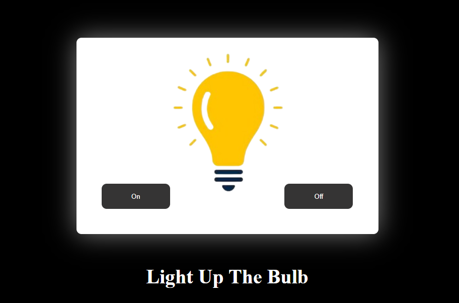

# 💡 LightItUp

**Toggle the vibe!** A fun and interactive light bulb project built with HTML, CSS, and JavaScript. Click the switch and bring the light to life!

🚀 **Live Demo**: [codebybhumika.github.io/light-it-up](https://codebybhumika.github.io/light-it-up/)

---

## ✨ Features
- Interactive light bulb toggle
- Simple, clean UI with smooth transitions
- Beginner-friendly JavaScript practice
- Dark/light state switching logic

---

## 🛠️ Built With
- HTML5
- CSS3
- JavaScript (ES6)

---

## 📸 Preview


> _"Let there be light—with a click!"_

---

## 📁 Project Setup
Clone the repo and open `index.html` in your browser:

```bash
git clone https://github.com/CodeByBhumika/light-it-up.git
cd light-it-up
open index.html
